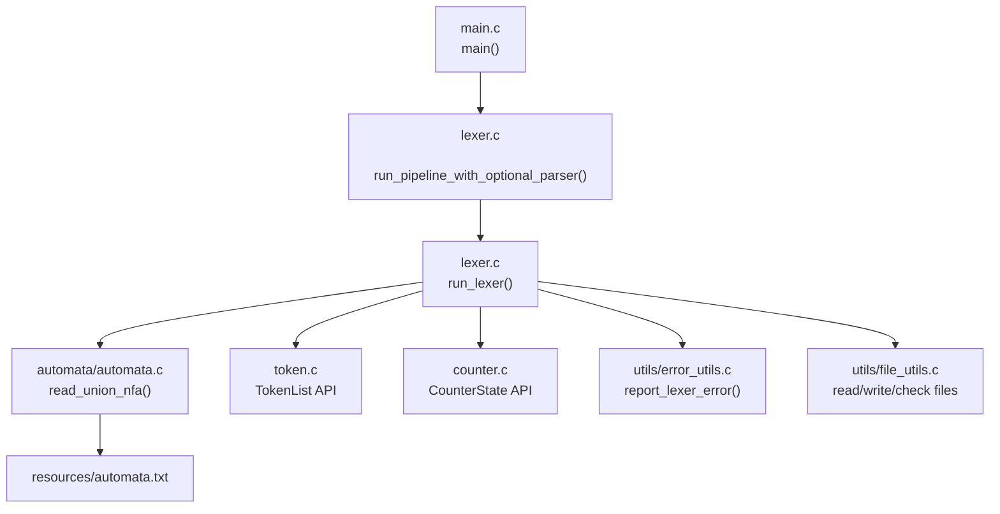
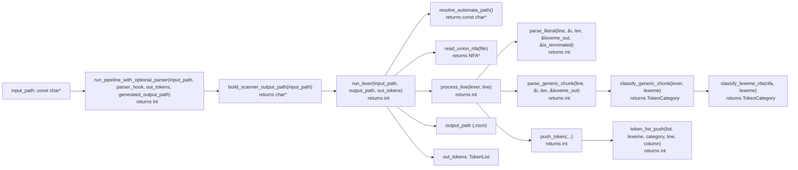
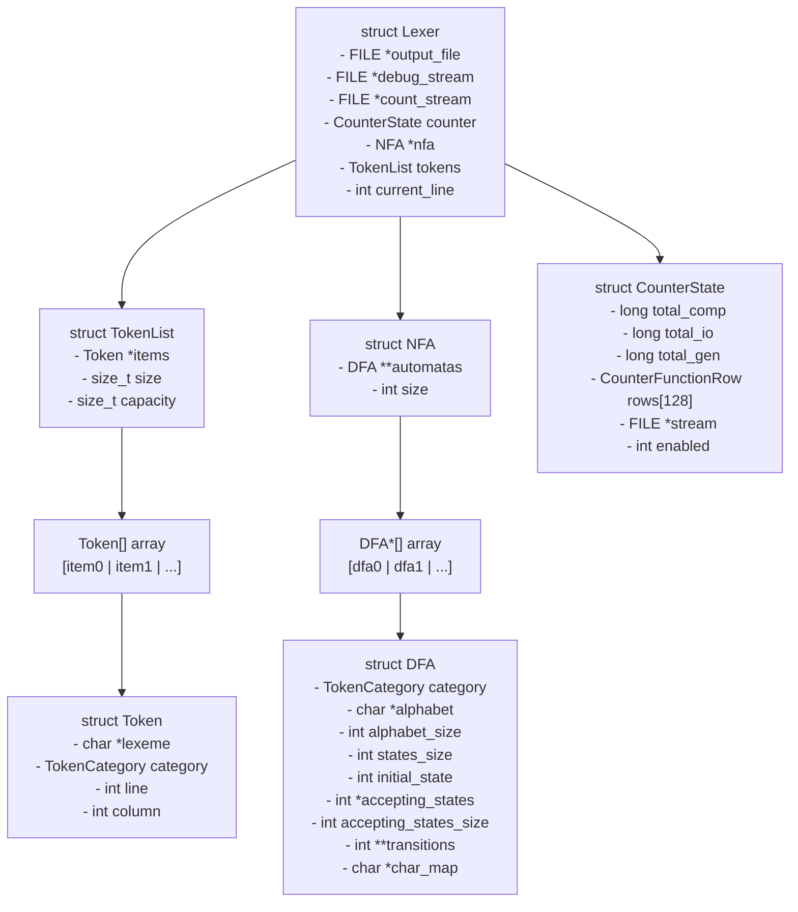
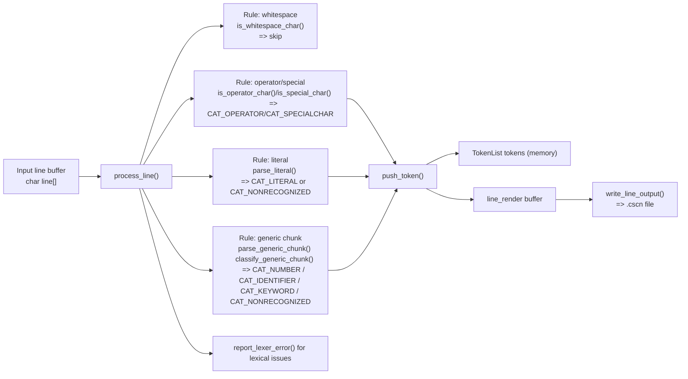

# Compiler Project Block Diagrams

This document summarizes the P2 lexical scanner architecture using **block diagrams** (not flow charts).
All function and type identifiers are taken directly from the code.

## 1. Module Block Diagram

## 2. Key Functionality Block Diagram (exact identifiers)

## 3. Data Structure Block Diagram

### Key file-tracking variables (input/output control)
- Input handling:
  - `FILE *input` in `run_lexer()`
  - `char line[LINE_BUFFER_SIZE]` in `run_lexer()`
  - `int i`, `int len` in `process_line()`
- Output handling:
  - `lexer.output_file` (`FILE *`) in `run_lexer()`
  - `char *output_path` from `build_scanner_output_path()`
  - `char *line_render`, `size_t line_render_len` in `process_line()`
  - `TokenList out_tokens` propagated to caller

## 4. Input/Output Transformation Diagram by Applied Rule

> In P2 there are no preprocessor directives in scanner input; transformation is by lexical rule application.

This is intentionally a **block-level design**. It models modules, interfaces, structures, and data movement without instruction-level control-flow detail.
